# 💰 DimDimApp – Checkpoint 3 (DevOps & Docker)

Aplicação desenvolvida para o 3º Checkpoint da disciplina de DevOps Tools & Cloud Computing da FIAP.

O projeto consiste em uma **API RESTful em Python com Flask**, que realiza operações de **CRUD de clientes bancários**, utilizando um banco de dados PostgreSQL, totalmente conteinerizado com Docker.

---

## 🚀 Tecnologias Utilizadas

- Python 3.10
- Flask + Flask SQLAlchemy
- PostgreSQL 15
- Docker + Docker Compose

---

## 📁 Estrutura do Projeto

```
dimdimapp/
│
├── app/
│   ├── main.py
│   ├── models.py
│   ├── database.py
│   └── requirements.txt
│
├── prints/                  
│   ├── docker-ps.png
│   ├── post-client.png
│   ├── get-clientes.png
│   ├── get-id.png
│   ├── put-client.png
│   ├── delete-client.png
│   ├── whoami.png
│   ├── pwd.png
│   ├── ls.png
│   ├── volume-ls.png
│   └── network-ls.png
│
├── Dockerfile
├── docker-compose.yml
├── .dockerignore
└── README.md
```


---

## ▶️ Como Executar o Projeto

1. Clone o repositório:
```bash
git clone hhttps://github.com/luizkamada1/checkponint3_docker.git
cd dimdimapp
```

2. Inicie os containers:
```bash
docker-compose up --build -d
```

3. Verifique se os containers estão ativos:
```bash
docker ps
```
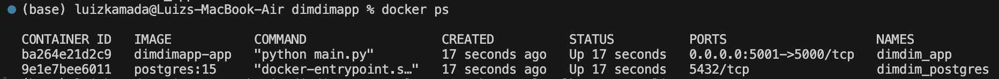

---

## 🧪 Testes da API

### ✅ Criar cliente – `POST /clientes`
```bash
curl -X POST http://localhost:5001/clientes \
  -H "Content-Type: application/json" \
  -d '{"nome": "Ana", "email": "ana@email.com"}'
```
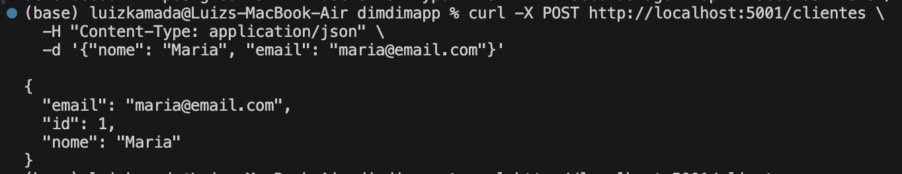

---

### ✅ Listar todos os clientes – `GET /clientes`
```bash
curl http://localhost:5001/clientes
```
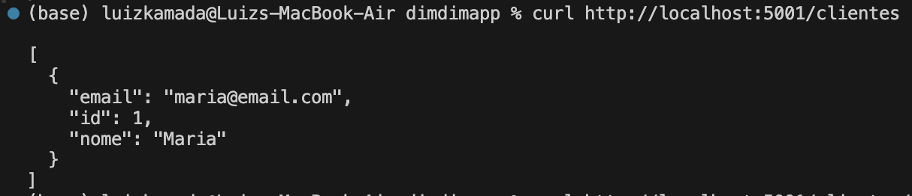

---

### ✅ Obter cliente por ID – `GET /clientes/<id>`
```bash
curl http://localhost:5001/clientes/1
```
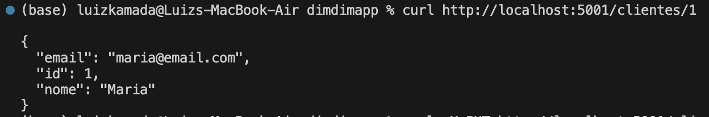

---

### ✅ Atualizar cliente – `PUT /clientes/<id>`
```bash
curl -X PUT http://localhost:5001/clientes/1 \
  -H "Content-Type: application/json" \
  -d '{"nome": "Ana Maria", "email": "ana.maria@email.com"}'
```
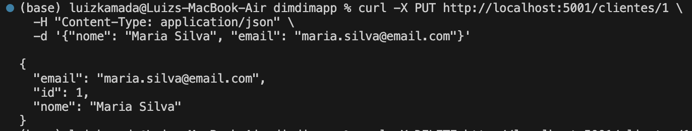

---

### ✅ Deletar cliente – `DELETE /clientes/<id>`
```bash
curl -X DELETE http://localhost:5001/clientes/1
```
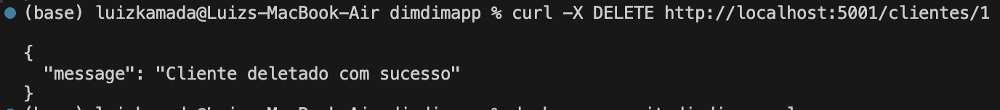

---

## 📸 Evidências do Funcionamento

### 🔹 Acesso ao container da aplicação

- `whoami`  
  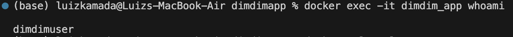

- `pwd`  
  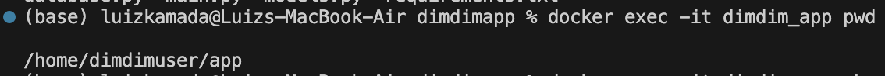

- `ls`  
  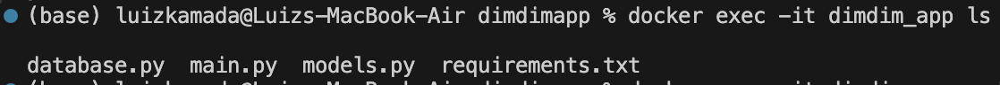

---

### 🔹 Volume e Rede Docker

- `docker volume ls`  
  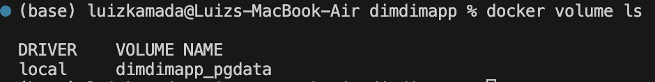

- `docker network ls`  
  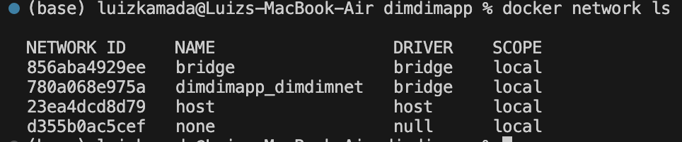

---

## 👥 Equipe

- **Luiz Kamada** – RM: *[557652]*

---

## 📝 Observações

- A aplicação implementa uma lógica de retry para aguardar a disponibilidade do banco antes de tentar criar as tabelas.
- Toda a aplicação roda com usuário não-root, usa `WORKDIR`, variáveis de ambiente e persistência via volume Docker.

---
